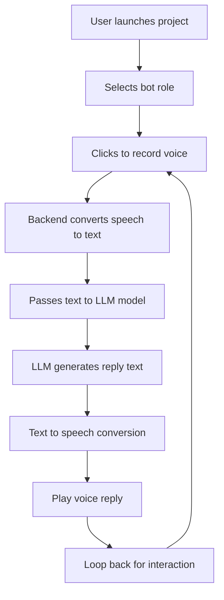
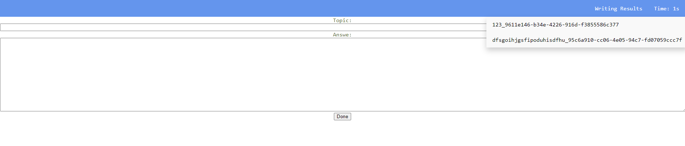
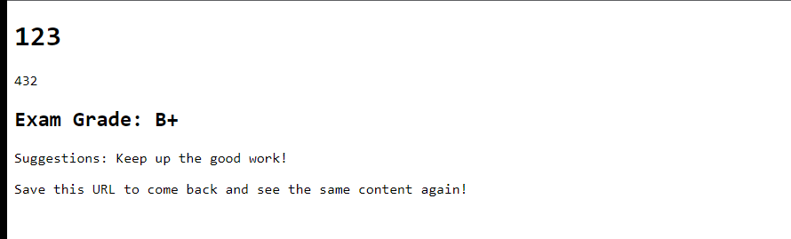

# Automated English Writing Evaluation using Openai API/Huggingface

This is a Python program that automatically evaluates English writing proficiency using the Openai ChatGPT API. You can input topics and articles, and the program will generate an automated evaluation report based on the given topic and article, including suggestions, corrections, examples, and more.

## Workflow


## Run the program

```
python app.py
```


## Screenshot





